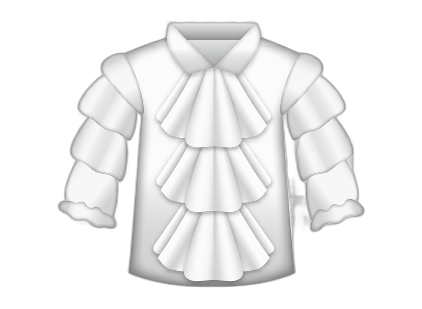

#Art Vandelay Industries (Tienda online)

_Este proyecto está enfocado en el desarrollo de una página web destinada a una pequeña tienda de regalos. Para su desarrollo se apuntó a la creación de un diseño sencillo, pero que sea actractivo y acorde a la temática de los productos que ofrecen._

## Estructura del proyecto 

_Esta página esta compuesta por cinco secciones que se encuentran enlazadas entre sí. Estas son: _

* index.html
* Historia 
* Productos 
* Ubicación
* Contacto 

### Index.html
_Es la página principal del proyecto, se muestra la información más relevante y se promueve el acceso al resto de las secciones._

#### Historia.html
_Otorga al usuario una breve descripción del origen de la empresa y las funciones que ocupan sus miembros._

### Productos
_ Da una breve descripción de los productos disponibles, su precio, modalidad de venta y envio _

### Ubicación
_Se proporciona información acerca de la locación de las sucursales, teléfonos de contacto y accesos.
### Contacto
_Se proporciona un formulario mediante el cual el usuario podrá dejar sugerencias, opiniones y/o informar sobre que productos está interesado.
_
###Un vistazo al código utilizado:
####HTML code

```html
<!DOCTYPE html>
<html lang="es">
<head>
    <meta charset="UTF-8">
    <meta name="viewport" content="width=device-width, initial-scale=1.0">   
    <meta name="keywords" content="gift store, indumentaria, regalos, cumpleaños, zapatillas, accesorios, juguetes, libros">
    <meta name="description" content="Los regalos mas divertidos e ingeniosos los escontrás en nuestra página web">
    <link href="https://cdn.jsdelivr.net/npm/bootstrap@5.1.0/dist/css/bootstrap.min.css" rel="stylesheet" integrity="sha384-KyZXEAg3QhqLMpG8r+8fhAXLRk2vvoC2f3B09zVXn8CA5QIVfZOJ3BCsw2P0p/We" crossorigin="anonymous">
    <link href="./css/style.css" rel="stylesheet" type="text/css">
    <link rel="preconnect" href="https://fonts.googleapis.com">
    <link rel="preconnect" href="https://fonts.gstatic.com" crossorigin>
    <link href="https://fonts.googleapis.com/css2?family=Rubik:wght@500&display=swap" rel="stylesheet">
    <title>Art Vandelay</title>
</head>
<body>
    <div class="contenedorPrincipal"><!--Contenedor principal comun a todas las secciones-->
        <header class="sticky-top"><!--comparte estructura y estilo con todas las secciones-->
            <nav class="menu navbar navbar-expand-lg navbar-light">
                <div class="container-fluid">
                    <a class="menu__home" href="index.html">
                        <div class="menu__ovalo">
                            <p class="menu__text"><span class="menu__text--especial">A</span>rt <span class="menu__text--especial">V</span>andelay</p>
                        </div>
                    </a>
                    <button class="navbar-toggler" type="button" data-bs-toggle="collapse" data-bs-target="#navbarTogglerDemo01" aria-controls="navbarTogglerDemo01" aria-expanded="false" aria-label="Toggle navigation">
                        <span class="navbar-toggler-icon"></span>
                    </button>
                    <div class="menu__desplegable collapse navbar-collapse" id="navbarTogglerDemo01">
                        <ul class="navbar-nav me-auto mb-2 mb-lg-0">
                            <li class="nav-item">
                                <a class="menu__enlaces" href="index.html">Home</a>
                            </li>
                            <li class="nav-item">
                                <a class="menu__enlaces" href="historia.html">Nosotros</a>
                            </li>
                            <li class="nav-item">
                                <a class="menu__enlaces" href="productos.html">Productos</a>
                            </li>
                            <li class="nav-item">
                                <a class="menu__enlaces" href="ubicacion.html">Sucursales</a>
                            </li>
                            <li class="nav-item">
                                <a class="menu__enlaces" href="contacto.html">Contacto</a>
                            </li>
                        </ul>
                    </div>
                </div>
            </nav>
        </header>
        <!--contenido exclusivo de la página principal-->
        <section class="presentacion">
            <h1 class="titulos">Art Vandelay</h1>
            <h2 class="titulos titulos--secundarios">Tienda de Regalos</h2>
        </section>
        <main class="portada">
            <div id="carouselExampleCaptions" class="carousel slide" data-bs-ride="carousel">
                <div class="carousel-indicators">
                    <button type="button" data-bs-target="#carouselExampleCaptions" data-bs-slide-to="0" class="active" aria-current="true" aria-label="Slide 1"></button>
                    <button type="button" data-bs-target="#carouselExampleCaptions" data-bs-slide-to="1" aria-label="Slide 2"></button>
                    <button type="button" data-bs-target="#carouselExampleCaptions" data-bs-slide-to="2" aria-label="Slide 3"></button>
                </div>
                    <div class="carousel-inner">
                        <div class="carousel-item active">
                        
                        <div class="carousel-caption d-md-block">
                            <h5 class="titulos titulos--carrusel">Productos Innecesarios</h5>
                            <p class="titulos titulos--carruselDos">que te morís de ganas de tener</p>
                        </div>
                        </div>
                        <div class="carousel-item">
                        
                        <div class="carousel-caption d-md-block">
                            <h5 class="titulos titulos--carrusel">Destacado del mes</h5>
                            <p class="titulos titulos--carruselDos">Puffy Shirt, la moda que se viene</p>
                        </div>
                        </div>
                        <div class="carousel-item">
                            
                        <div class="carousel-caption d-md-block">
                            <h5 class="titulos titulos--carrusel">Octubre solidario</h5>
                            <p class="titulos titulos--carruselDos">Tus compras aportan a la fundación Susan Ross</p>
                        </div>
                        </div>
                    </div>
                    <button class="carousel-control-prev" type="button" data-bs-target="#carouselExampleCaptions" data-bs-slide="prev">
                        <span class="carousel-control-prev-icon" aria-hidden="true"></span>
                        <span class="visually-hidden">Previous</span>
                    </button>
                    <button class="carousel-control-next" type="button" data-bs-target="#carouselExampleCaptions" data-bs-slide="next">
                        <span class="carousel-control-next-icon" aria-hidden="true"></span>
                        <span class="visually-hidden">Next</span>
                    </button>
            </div>
        </main>
        <section class="flyer">
            <a class="flyer__enlace" href="ubicacion.html">
                
            </a>
            <a class="flyer__texto" href="ubicacion.html">Te esperamos en nuestras sucursales</a>
        </section>
        <section class="flyer flyer--colores">
            <a class="flyer__texto" href="ubicacion.html#envio">Enviamos tu compra a todo el país</a>
            <a class="flyer__enlace" href="ubicacion.html#envio">
                
            </a>
        </section>
        <section class="flyer">
            <a class="flyer__enlace" href="contacto.html">
                
            </a>
            <a class="flyer__texto" href="contacto.html">Estamos esperando tu llamado</a>
        </section>
        <!--fin del contenido exclusivo de la página principal-->
        <aside class="informacion"><!--comparte estructura y estilo con todas las secciones-->
            <ul class="informacion__enlaces nav nav-tabs">
                <li class="nav-item">
                    <a class="nav-link" aria-current="page" href="mapa.html" target="blank">Mapa del sitio</a>
                </li>
                <li class="nav-item">
                <a class="nav-link" href="https://www.argentina.gob.ar/produccion/defensadelconsumidor" target="blank">Defensa del Consumidor</a>
                </li>
            </ul>
        </aside>
        <footer class="footer"><!--comparte estructura y estilo con todas las secciones-->
            <div class="footer__sucursales">
                <h2 class="footer__titulos">Vení a conocer nuestras sucursales</h2>
                <ul>
                    <li>Boulevard Shopping: Av. Hipolito Yrigoyen 13298, Adrogué</li>
                    <li>Unicenter: Paraná 3745, Martinez</li>
                    <li>Plaza Oeste Shopping: Av. Brig Gra. Juan Manuel de Rosas, Castelar</li>
                    <li>Alto Palermo Shopping: Av. Santa Fe 3253, CABA</li>
                    <li><a href="ubicacion.html">Hacé clic acá para más información</a></li>
                </ul>
            </div>
            <div class="footer__contacto">
                <h2 class="footer__titulos">Llamanos o escribinos a nuestras redes</h2>
                <ul>
                    <li>Tel: 0800-222-2299</li>
                    <li>Mail: <a href="mailto:contacto@artvandelay.com">contacto@artvandelay.com</li>
                    <li><a href="contacto.html">Dejanos tus datos y nosotros te llamamos</a></li>
                </ul>
                <a href="http://facebook.com" target="_blank"></a>
                <a href="http://instagram.com" target="_blank"></a>
                <a href="http://twitter.com" target="_blank"></a>
            </div>           
            <div class="footer__referencia">
                <P class="footer__texto text-center">Todos los derechos reservados (2021). Inspirada "levemente" en </p><a href="https://youtu.be/ib_dCSe6Iz8" target="_blank"></a>
            </div>
        </footer>    
    </div>
    <script src="https://cdn.jsdelivr.net/npm/@popperjs/core@2.9.3/dist/umd/popper.min.js" integrity="sha384-eMNCOe7tC1doHpGoWe/6oMVemdAVTMs2xqW4mwXrXsW0L84Iytr2wi5v2QjrP/xp" crossorigin="anonymous"></script>
    <script src="https://cdn.jsdelivr.net/npm/bootstrap@5.1.0/dist/js/bootstrap.min.js" integrity="sha384-cn7l7gDp0eyniUwwAZgrzD06kc/tftFf19TOAs2zVinnD/C7E91j9yyk5//jjpt/" crossorigin="anonymous"></script>
    </body>
</html>
```

## Herramientas utilizadas 

_Para el desarrollo de esta proyecto se utilizaron los siguientes lenguajes:_
* HTML 5,
*	SCSS
* CSS,
* boostrap 5 (https://getbootstrap.com) ,
* Google Fonts (https://fonts.google.com/)

## Software complementario📋

_A lo largo del desarrollo de la página web también se hizo uso de las siguientes herramientas_

*	GitHub
* NodeJS

## Instalación 🔧

_Puede descargar el proyecto utilizando GitHub.  _

_ 1) Ingrear al repositorio donde se encuentra el proyecto (https://github.com/Pavlopkin/Art-Vandelay) _

_2) Hacer clic en el botón "code"._

_3) Una vez desplegada las opciones, seleccionar "download Zip. _

_4) Descomprimir la carpeta  y hacer clic en index.html. La página se ejecutará inmediatamente. _

## Autor ✒️

_Este sitio fue creado a los fines de ser presentado como proyecto finan el Coderhouse.com por:_

* **Pablo Rodrigo Gomez** - *Diseño y contenido* - [pavlopkin](https://github.com/pavlopkin)


###End
